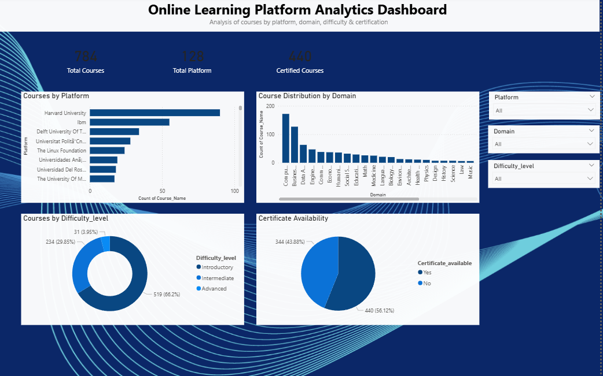

© 2025 Bhagyashri Mahajan. All rights reserved.

This project is part of my personal data analytics portfolio.
Unauthorized copying, reuse, or distribution is strictly prohibited.

---

# Online Learning Platform Analytics Dashboard

## 📌 Project Overview
This project analyzes online learning platforms to understand
course distribution by platform, domain, difficulty level,
and certification availability.

## 🎯 Problem Statement
Learners often struggle to choose the right platform and course.
This dashboard provides insights to help users make informed decisions.

## 📊 Dataset Description
- Cleaned dataset containing online course details
- Includes platform, domain, difficulty level, and certification status

## 🛠 Tools Used
- Power BI
- Microsoft Excel
- GitHub

## 📈 Key KPIs
- Total Courses
- Total Platforms
- Certified Courses

## 🔍 Insights
- Computer Science & Data domains have the highest number of courses
- Beginner-level courses dominate the platforms
- Many platforms offer certified courses

## 🖼 Dashboard Preview

## 📂 Project Files
- `online_courses_main_cleaned.csv` – Cleaned dataset
- `online_learning_platform_analytics2.pbix` – Power BI file

## 📌 Author
**Bhagyashri Mahajan**  
Aspiring Data Analyst
